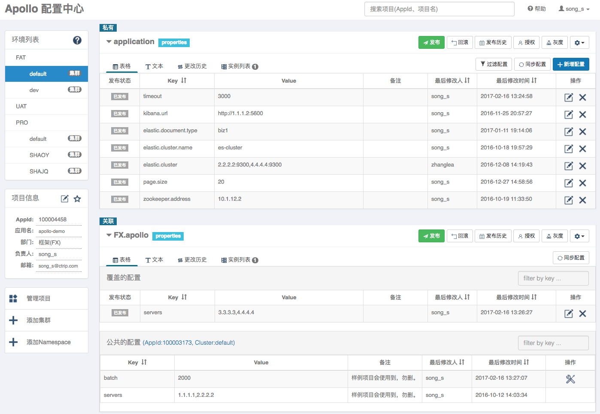
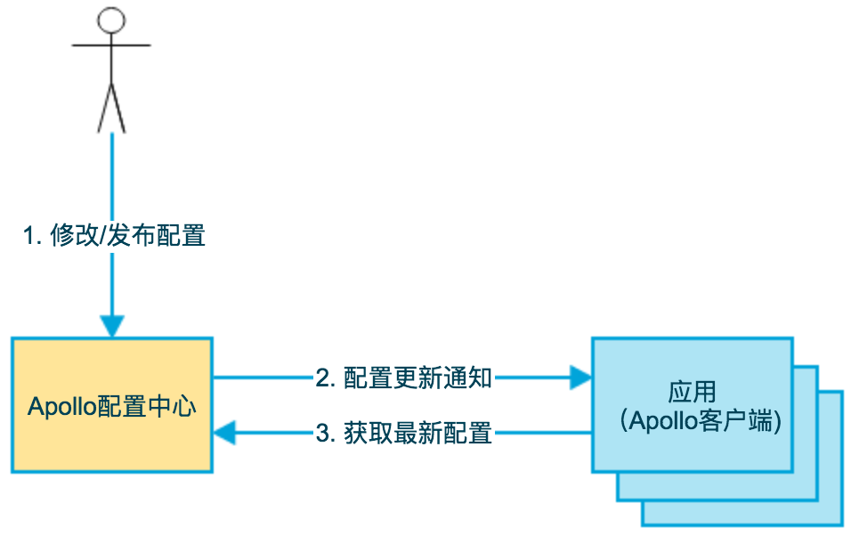
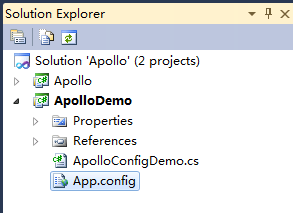

# Apollo-otherDB-2.2.0-unified

> 基于 [Apache Apollo](https://github.com/apolloconfig/apollo) 2.2.0 的多数据库统一改造版，一套构建产物即可在 **达梦（DM8）/ PostgreSQL / 人大金仓（KingbaseES，PG 模式）/ MySQL / H2** 之间动态切换。

Apollo 是一款可靠的分布式配置中心，用于集中管理不同环境（开发、测试、生产）、不同集群的配置，并在发布后实时推送给应用。本工程在其 2.2.0 版本基础上，将针对国内主流数据库（达梦、人大金仓）以及 PostgreSQL 的适配整合为同一份工程，**通过修改配置文件即可切换数据库**，而无需分别维护多套源码、多套构建。



---

## 目录

- [特性](#特性)
- [架构](#架构)
- [支持数据库](#支持数据库)
- [项目结构](#项目结构)
- [快速开始](#快速开始)
- [数据库动态切换](#数据库动态切换)
- [部署](#部署)
- [配置说明](#配置说明)
- [License](#license)

---

## 特性

- **单产物，多数据库**：MySQL、PostgreSQL、达梦、人大金仓（PG 模式）、H2 的 JDBC 驱动全部打入同一个可执行 jar。一次构建，运行期任意切换，**无需按数据库构建不同版本**。
- **配置文件切换，重启生效**：仅需修改 `SPRING_PROFILES_ACTIVE`（选择数据库 Profile）与 `SPRING_DATASOURCE_URL / USERNAME / PASSWORD`（注入连接信息），重启服务即可切换数据库。
- **达梦深度适配**：内置 `DamengDialect`、`DamengIdentityColumnSupport`、`DamengGetGeneratedKeysDelegate`，解决 DM8 的分页（`OFFSET..FETCH`）、IDENTITY 列、主键回取等差异，仅在 `dm` Profile 下启用，不影响其它数据库。
- **兼容性保持**：保留 Apollo 原生的 Spring Profile 机制与 Docker/k8s 部署能力；Portal 登录（`auth` Profile）可直接复用。
- **分类 SQL 脚本**：四套建库脚本按库型分目录维护，统一命名 `apolloconfigdb.sql` / `apolloportaldb.sql`。
- **应用级导出**：Portal 应用页侧边栏（管理应用下方）新增「导出应用」入口，可按环境导出单个应用的自有 Namespace，并可选包含关联的公共 Namespace；关联公共 Namespace 未创建或无读权限时记入导出包内的依赖清单（`export.manifest.json`）。导出包与现有「配置导出导入」页面的导入功能完全兼容，可直接回导。

## 架构

沿用 Apollo 经典的“配置中心 + 管理端”三层架构：客户端通过 ConfigService 拉取与订阅配置，AdminService 负责配置管理与发布，Portal 面向使用者集中管理多环境、多集群的配置；三个服务均连接后端数据库存储元数据。



各服务与数据库的对应关系如下，本工程的核心改动即是在这些服务与后端数据库之间实现「一套依赖、运行期动态切换」：

- `apollo-configservice` / `apollo-adminservice` —— 连接 `ApolloConfigDB`
- `apollo-portal` —— 连接 `ApolloPortalDB`



配置从发布到客户端生效的实时推送链路与原生 Apollo 完全一致，仅后端存储引擎可替换为达梦 / PostgreSQL / 人大金仓（PG 模式）等数据库。

## 支持数据库

| 数据库 | Profile | 说明 |
| ------ | ------- | ---- |
| MySQL | `mysql`（默认） | Apollo 原生支持 |
| H2 | `h2` | 本地开发/测试 |
| PostgreSQL | `postgre` | Hibernate 依据 URL 自动识别 |
| 达梦 DM8 | `dm` | 需先安装达梦驱动，使用内置达梦方言 |
| 人大金仓（PG 模式） | `kingbase` | 复用 PostgreSQL 驱动，与 PG 高度兼容 |

## 项目结构

```
Apollo-otherDB-2.2.0-unified/
├── apollo-common/            # 公共模块：达梦方言类 + 各数据库 Profile 配置
├── apollo-configservice/     # ConfigService（连接 ApolloConfigDB）
├── apollo-adminservice/      # AdminService（连接 ApolloConfigDB）
├── apollo-portal/            # Portal（连接 ApolloPortalDB）
├── apollo-assembly/          # 打包聚合
├── scripts/                  # 构建脚本、达梦驱动安装脚本、分类 SQL
├── deploy/                   # Docker / k8s 部署示例
└── README-Database-Switching.md   # 数据库切换与部署的详细说明
```

## 快速开始

### 1. 安装达梦驱动（一次即可，仅切换到达梦时需要）

达梦驱动不在公共 Maven 仓库，需先安装到本地仓库：

```bash
sh scripts/install-dm-driver.sh     # Linux / macOS
scripts\install-dm-driver.bat       # Windows
```

### 2. 构建

```bash
mvn clean package -DskipTests
```

或使用统一构建脚本（配置/管理服务与 Portal 并行构建）：

```bash
sh scripts/build.sh                 # 或 scripts\build.bat
```

### 3. 初始化数据库

在所选数据库中执行对应脚本：

| 数据库 | 脚本目录 |
| ------ | -------- |
| MySQL | `scripts/sql/MySQL/` |
| PostgreSQL | `scripts/sql/Postgresql/` |
| 人大金仓 | `scripts/sql/Kingbase/` |
| 达梦 DM8 | `scripts/sql/Dameng/` |

每类目录下均为 `apolloconfigdb.sql`（ApolloConfigDB）与 `apolloportaldb.sql`（ApolloPortalDB）。

### 4. 启动

以 PostgreSQL 为例（configservice / adminservice 连 ConfigDB，portal 连 PortalDB）：

```bash
export SPRING_PROFILES_ACTIVE=github,postgre
export SPRING_DATASOURCE_URL=jdbc:postgresql://<pg-host>:5432/configdb
export SPRING_DATASOURCE_USERNAME=postgres
export SPRING_DATASOURCE_PASSWORD=****
java -jar apollo-configservice/target/apollo-configservice-xxx.jar
```

## 数据库动态切换

切换数据库只需修改运行时的 Profile 与连接环境变量，然后重启服务：

```bash
# PostgreSQL
SPRING_PROFILES_ACTIVE=github,postgre
# 达梦 DM8（先 install-dm-driver）
SPRING_PROFILES_ACTIVE=github,dm
# 人大金仓（PG 模式）
SPRING_PROFILES_ACTIVE=github,kingbase
```

> 注意：Portal 需额外激活 `auth` Profile 才能启用登录认证，否则会进入“默认免认证”模式
> （固定用户 `apollo`、无法退出）。完整说明见 README-Database-Switching.md。

## 部署

- **Docker**：`deploy/docker/`，`docker-compose.example.yaml` + `.env.example`，修改 `.env` 即可切换库型。
- **Kubernetes**：`deploy/k8s/`，`configmap.yaml`（切库配置）+ `apollo-2.2.0.yaml`（Deployment/Service，命名空间 `apollo`）。
- 各服务已自带 `Dockerfile`，镜像内已内置多数据库驱动。

## 配置说明

详细的数据库切换、构建、部署、达梦适配与常见问题，参见：

- [README-Database-Switching.md](./README-Database-Switching.md)

## 致谢

本工程基于 [apolloconfig/apollo](https://github.com/apolloconfig/apollo) 2.2.0 改造，感谢 Apollo 社区。

## License

基于原始 Apollo 项目的许可协议发布，详见 [LICENSE](./LICENSE)。